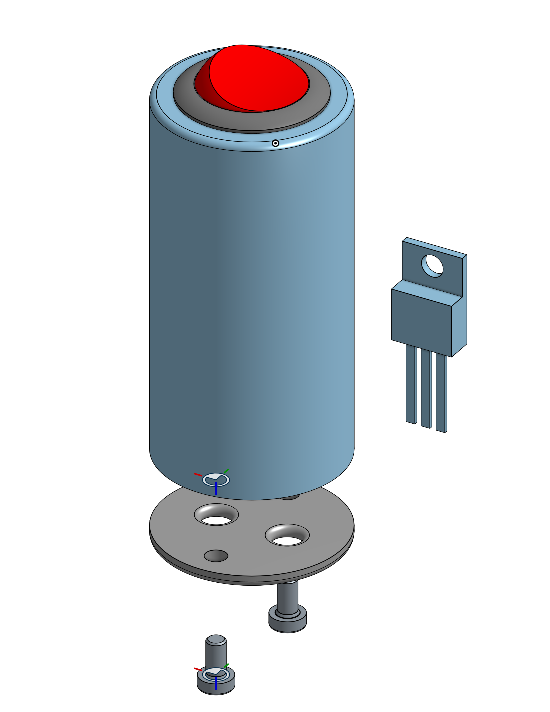
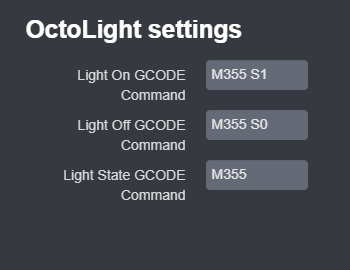

# OctoCaseLight
A simple plugin that adds a button to the navigation bar for toggling the case light using M355 commands.
It is a fork of gigibu5's OctoLight plugin, adapted for gcode commands rather than rPi GPIO.

I am using this plugin to control an LED light bar that is above my printer, and plugged into the neopixel port (through an adapter) of the SKR mini e3 motherboard. 
The adapter consists of a female USB port to plug the light bar into, a 3-conductor cable for plugging into the motherboard, a SPDT switch (for overriding the motherboard control), and an N-Channel MOSFET that resides between the ground wires of the USB port and the 3-conductor cable. The gate of the MOSFET is controlled by the control pin of the neopixel port. A 10k ohm resistor is connected from the gate to source pins of the MOSFET to make sure it switches off when required. 

## Setup
Install manually using this URL:

	https://github.com/adam3654/OctoCaseLight/archive/master.zip

## Configuration

Curently, you can configure three settings:
- `Light On GCODE Command`: Turns the Case Light On
	- Default value: M355 S1
	
- `Light Off GCODE Command`: Turns the Case Light Off
	- Default value: M355 S0

- `Light State GCODE Command`: Returns the current state of the light
	- Default value: M355
## API
Base API URL : `GET http://YOUR_OCTOPRINT_SERVER/api/plugin/octocaselight?action=ACTION_NAME`

This API always returns updated light state in JSON: `{state: true}`

_(if the action parameter not given, the action toggle will be used by default)_
#### Actions
- **toggle** (default action): Toggle light switch on/off.
- **turnOn**: Turn on light.
- **turnOff**: Turn off light.
- **getState**: Get current light switch state.

